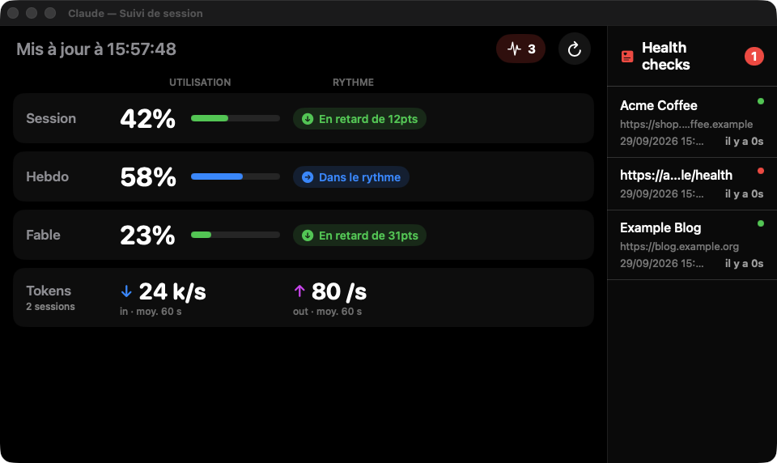

# Claude Usage Dashboard

A native macOS menu-bar app and dashboard (Swift / SwiftUI) that keeps an eye on your **Claude plan usage limits** — current session, weekly limit and model-scoped weekly limit — and tells you whether you are ahead of or behind the pace needed to last until the next reset. It also shows the live token throughput of your running Claude Code sessions and a small uptime monitor for a few URLs of your choice.

> The UI is in French.

## Screenshot

*Demo build with made-up usage figures, sessions and URLs.*



## Features

- **Menu-bar title** with the session / weekly / model usage percentages, a pace arrow and the time left before each reset, refreshed every minute.
- **Dashboard window**: usage bars, pace ("in advance / on track / behind by N points"), reset countdown, projected usage at reset and the pause needed to get back on pace.
- **Token throughput**: reads the local Claude Code transcripts (`~/.claude/projects/**/*.jsonl`) incrementally and shows input / output tokens per second, context size and output tokens of the active sessions. Nothing leaves the machine.
- **Health checks**: pings a list of URLs every 10 minutes and flags the ones returning errors (menu → *Gérer les URLs surveillées…*).
- Keeps the display awake while the dashboard is open (handy on a secondary screen).

## Setup

The usage figures come from the same endpoint the claude.ai usage page uses. On first launch the app asks for it:

1. Open `claude.ai/settings/usage` in your browser, open the developer tools (`⌘⌥I`) › **Network**, reload the page.
2. Right-click the `usage` request › **Copy › Copy as cURL (bash)**.
3. Paste it in the setup sheet. The app extracts the URL and the session cookie and stores them in the **macOS Keychain** (never on disk in clear text).

When the cookie expires the menu-bar icon shows 🔒; use *Reconfigurer la session* to paste a new one.

## Build and run

Requires macOS 14+ and the Xcode Command Line Tools.

```bash
./build_app.sh          # builds dist/ClaudeUsageDashboard.app (ad-hoc signed)
./deploy.sh             # rebuilds, installs in /Applications and relaunches
```

To start it at login, copy `LaunchAgent/*.plist` to `~/Library/LaunchAgents/` and `launchctl load` it (adjust the app path inside if needed).

## Project structure

```
Sources/ClaudeUsageDashboard/
  AppDelegate.swift                 status item, menu, windows
  UsageService.swift                polls the usage endpoint
  PaceCalculator.swift              pace, projection and pause computations
  CurlParser.swift                  extracts URL + cookie from a pasted cURL command
  KeychainStore.swift               stores the configuration in the Keychain
  TokenMonitor.swift                live token throughput from Claude Code transcripts
  URLMonitor.swift                  URL health checks
  DisplaySleepBlocker.swift         keeps the screen awake while the dashboard is open
  Views/                            SwiftUI dashboard, setup sheet, URL settings
```

*Not affiliated with Anthropic.*
